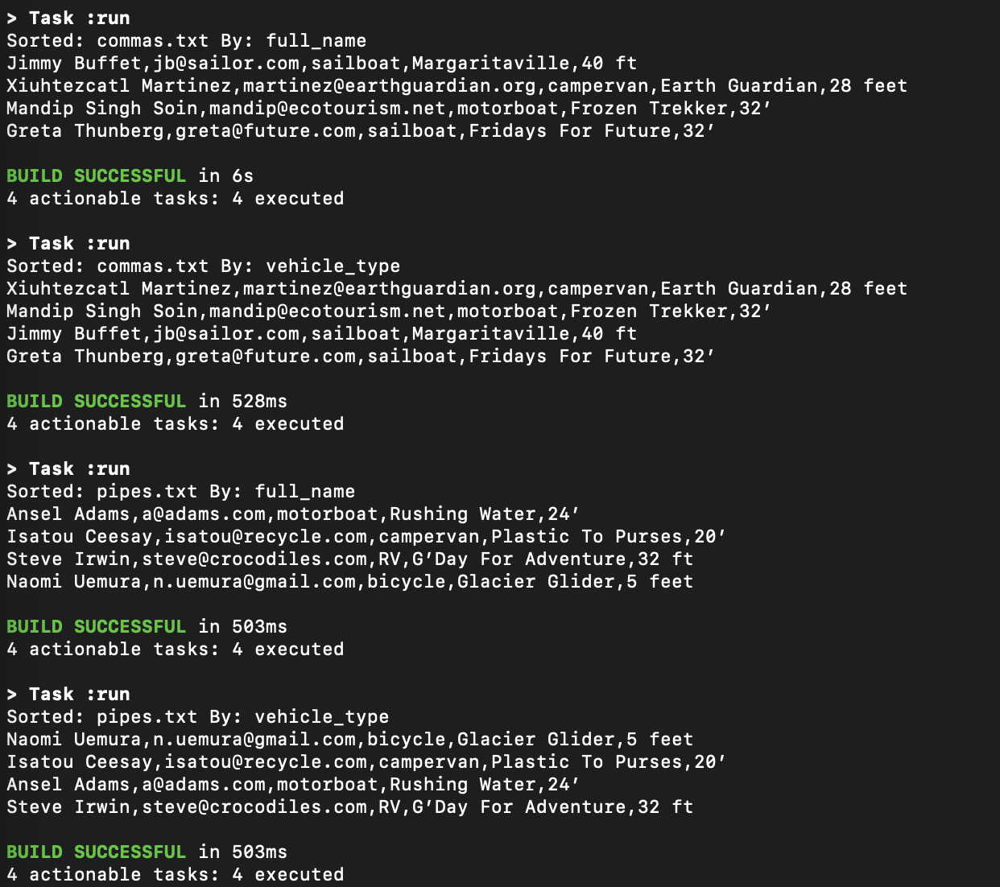

## WLG Take Home Assignment
The provided input files are under:
 - commas: 
   - resources/commas.txt
 - pipes:
   - resources/pipes.txt
   
The main entry point for the app is:
```
java/org/tolley/wlg/vehicleprocessor/VehicleProcessor.java
```

To easily test this application, do the following:
- Docker must be installed
- Clone this repo
- Run the following command: 
```
./run.sh
```
  - NOTE: The first time this command is run, it may take a minute or so (depending on internet speed) to download the base Docker image.
  - Subsequent runs will be much faster, due to the image already being downloaded
- This will do the following:
  - Build a docker image which can run the application
  - Use docker-compose to start the container
  - Runs the following commands inside the started container:
```
docker-compose exec wlg-takehome gradle clean run --args="-file commas.txt -sort full_name"
docker-compose exec wlg-takehome gradle clean run --args="-file commas.txt -sort vehicle_type"
docker-compose exec wlg-takehome gradle clean run --args="-file pipes.txt -sort full_name"
docker-compose exec wlg-takehome gradle clean run --args="-file pipes.txt -sort vehicle_type"
```
  - Displays the parsed and sorted output in the command line
  - Stops the running container
  - The output should look like the following:
    

To run the application locally (outside the docker container) from the command line:
- The following must be installed:
  - Java jdk 18
  - gradle 7.4.2
- run the command:
```
gradle clean run --args="-file pipes.txt -sort vehicle_type"
```
  - -file can be one of two arguments: commas.txt or pipes.txt
  - -sort can be one of two arguments: vehicle_type or full_name
  - This will display the results, correctly parsed and sorted, to the command line
    - If invalid arguments are supplied, an exception will be thrown

Post assignment questions:
- 1: Sorting by Full Name: 
  - For this exercise I first sort by the customers last name, and then first name.
  - If this was a normal real-work project, I would make sure that approach was acceptable
  - and not just something I determined myself.
- 2: Sorting by Vehicle Type:
  - For this sort I sort by the Vehicle Type, but then if there are multiple of the same type
  - such as sailboats in the comma file, right now it's then sorting by full name. The Vehicle Type
  - sort is case-insensitive, so B will be displayed before c
  - If this was a normal real-work project, I would make sure that approach was acceptable
  - and not just something I determined myself.
- 3: Vehicle Length input: 
  - I asked Justin his opinion for this question, and in the end I decided for a simple approach
  - to finishing the assignment. For the length data, it wasn't normalized. Some lines would have
  - 30', some 30 ft, and some 30 feet. My initial thoughts were to strip the non-standard text 
  - and try to normalize the input. The fact that data can come in this way makes sense, as if
  - someone is entering data into a spreadsheet, they may use different qualifiers for each entry
  - not even realizing they are doing it, or possibly more than one person enters the data and they
  - did not have a standard way to do it. Also my initial thoughts of normalizing would not account
  - for non-imperial sizes, so I decided to keep the length as a string.
  - If this was a normal real-work project, I would make sure that approach was acceptable
  - and not just something I determined myself.